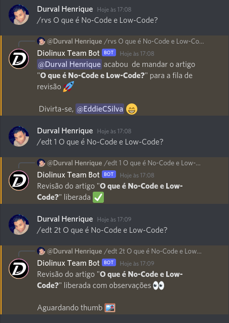

<h1 align="center">
   
  
    
<a href="https://diolinux.com.br/">Diolinux</a> Team Bot
   
</h1>

  

> Um bot desenvolvido para auxiliar a equipe do Diolinux no Discord.

 

# Tecnologias

Este projeto foi desenvolvido utilizando:

- <a href="https://discord.js.org/#/"> Discord.js </a>
- <a href="https://nodejs.org/en/"> Node.js </a>

Projeto atualmente hospedado em:

- <a href="https://discloudbot.com/">Discloud</a>

 

# Mantenedor

[Durval Henrique 
(Lavrudinho)](https://github.com/Lavrudin)

 

